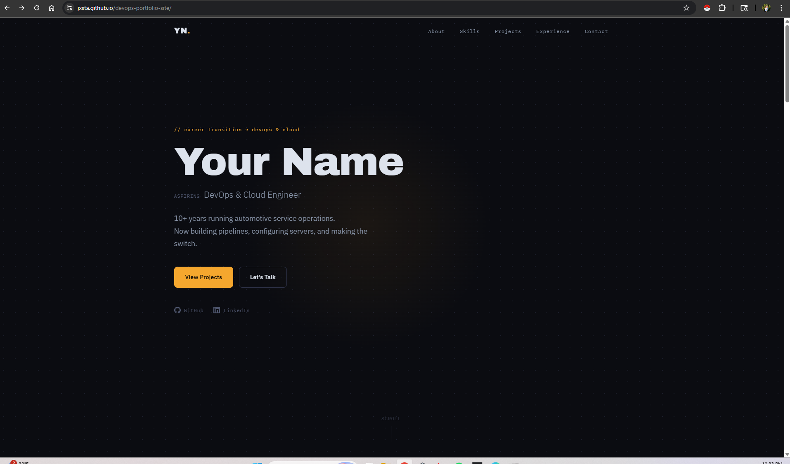
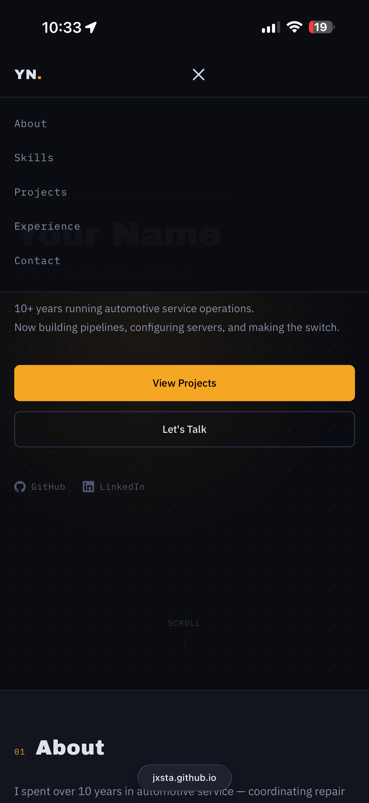
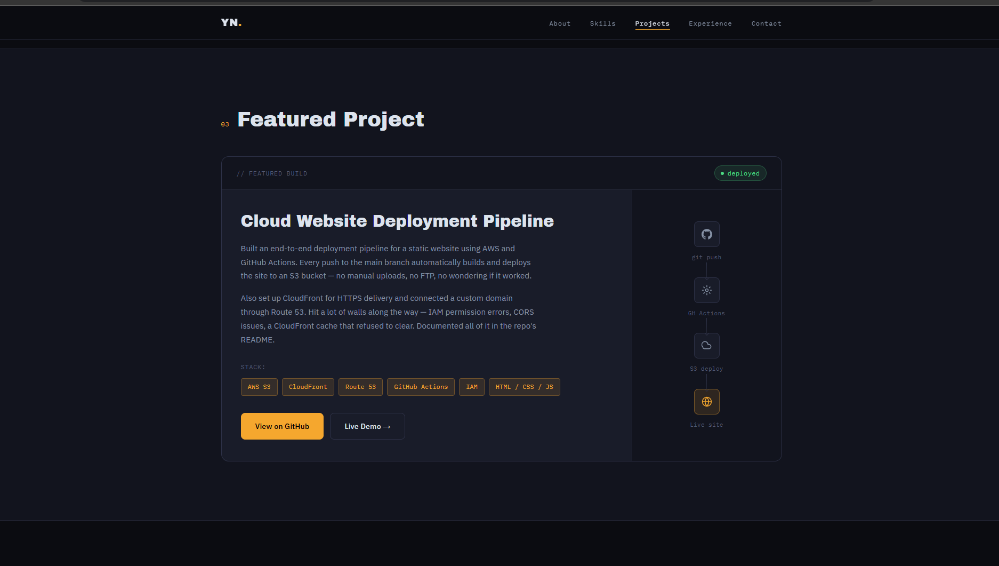
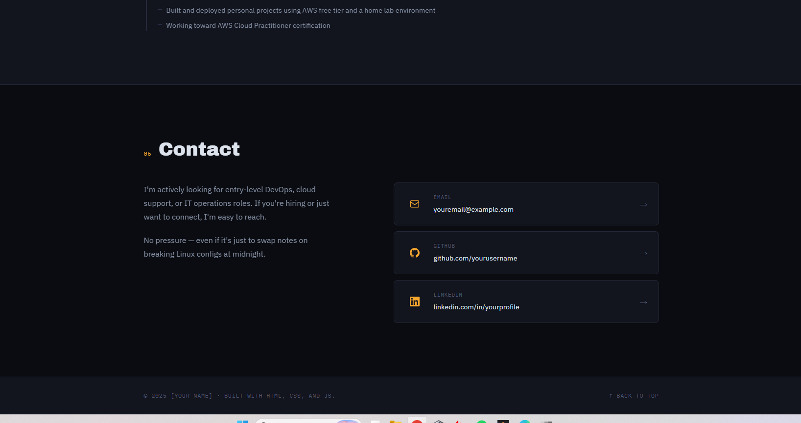

# Personal DevOps Portfolio Site

A clean, responsive personal portfolio built from scratch with HTML, CSS, and JavaScript — no frameworks, no dependencies, no build step. Designed to showcase a career transition from automotive service operations into DevOps and cloud engineering.

**[View Live Site →](https://jxsta.github.io/devops-portfolio-site)**

---

## Overview

This project serves two purposes: it's a working portfolio site, and it's itself a demonstration of the skills it describes. The site is version-controlled on GitHub, deployed via a CI/CD pipeline, and served over HTTPS with a custom domain — the same workflow used to ship production web applications.

The content focuses on honest, entry-level DevOps skills: Linux administration, cloud basics, Git, and CI/CD — paired with a decade of operations and customer-facing experience.

---

## Live Demo

**[https://jxsta.github.io/devops-portfolio-site](https://jxsta.github.io/devops-portfolio-site)**

Hosted on GitHub Pages from the `main` branch. To enable:
1. Go to **Settings → Pages**
2. Set source to **Deploy from a branch** → `main` → `/ (root)`
3. The URL above will go live within a few minutes

To connect a custom domain later, add a `CNAME` file and configure DNS with your registrar.

---

## Features

- Single-page layout with smooth-scroll navigation
- Fixed navbar with scroll-triggered background blur
- Mobile-responsive design with a hamburger menu
- Scroll-triggered fade-in animations using `IntersectionObserver`
- Active section highlighting in the navbar
- CSS-only dot-grid hero background and pipeline diagram
- No JavaScript libraries — vanilla JS only
- Semantic HTML with ARIA labels
- Easy to edit — all content lives in `index.html`, all colors in CSS variables

---

## Tech Stack

| Layer | Technology |
|-------|-----------|
| Structure | HTML5 |
| Styling | CSS3 (custom properties, grid, flexbox, keyframe animations) |
| Behavior | Vanilla JavaScript (ES6) |
| Fonts | Google Fonts — Archivo Black, IBM Plex Sans, IBM Plex Mono |
| Hosting | GitHub Pages (or AWS S3 + CloudFront) |
| CI/CD | GitHub Actions |
| Domain | Custom domain via DNS CNAME |

---

## File Structure

```
devops-portfolio-site/
├── index.html       # All page content and HTML structure
├── style.css        # Design system, layout, animations, responsive styles
├── script.js        # Nav scroll, mobile menu, scroll-reveal, smooth scroll
└── README.md        # This file
```

**index.html** is organized with comment blocks for each section, making it easy to find and edit any part:

```
nav → hero → about → skills → featured project → additional projects → experience → contact → footer
```

**style.css** is organized top-to-bottom:

```
1. Design tokens (:root variables)
2. Reset & base
3. Utilities (container, buttons, tags)
4. Navigation
5. Hero
6. Each content section
7. Footer
8. Scroll animations
9. Media queries
```

---

## How to Run Locally

No installs required. Open the file directly or use a simple local server:

```bash
# Simplest: open directly in a browser
open index.html          # macOS
start index.html         # Windows
xdg-open index.html      # Linux

# Recommended: local dev server (avoids browser file:// quirks)
npx serve .

# Or with Python (built into most systems)
python3 -m http.server 8000
# then open http://localhost:8000
```

---

## Deployment

**Current:** GitHub Pages — `https://jxsta.github.io/devops-portfolio-site`

**Planned upgrade (AWS pipeline):**

The featured project on this site describes an end-to-end AWS deployment pipeline. The goal is to migrate this site onto that same infrastructure:

```
git push → GitHub Actions → aws s3 sync → CloudFront invalidation → live
```

Steps to implement:
1. Create an S3 bucket with static website hosting enabled
2. Set a bucket policy for public read access
3. Create a CloudFront distribution pointed at the S3 origin
4. Issue an SSL certificate via ACM
5. Add a custom domain through Route 53 (or any DNS provider)
6. Add `.github/workflows/deploy.yml` to automate the sync on every push to `main`

This migration is intentional — it's a chance to document a real deployment process rather than just describe one.

---

## Screenshots

<p align="center">
  
  &nbsp;
  
</p>
<p align="center"><em>Desktop and mobile — responsive layout</em></p>

<br />

<p align="center">
  
</p>
<p align="center"><em>Featured Project — Cloud Website Deployment Pipeline</em></p>

<br />

<p align="center">
  
</p>
<p align="center"><em>Contact section with social links</em></p>

---

## Why This Project Matters for a DevOps Portfolio

Most job postings for entry-level DevOps roles ask for experience with Git, CI/CD, cloud hosting, and Linux. This project touches all of those — not in a tutorial, but in a real deployed artifact.

**What it demonstrates:**

- **Git workflow** — the repo has a meaningful commit history with descriptive messages
- **Static site hosting** — deploying over HTTPS to a CDN is a core infrastructure task
- **CI/CD thinking** — the deployment is automated; pushing code is the only manual step
- **Documentation** — this README is written for a technical audience, not just a portfolio viewer
- **Ownership** — the site was built and deployed by one person, start to finish

For a career changer with no professional tech experience, a project like this shows that you understand how modern deployment works — not just that you can write a webpage.

---

## Customization Guide

All content is in `index.html`. Search and replace these placeholders:

| Placeholder | Replace with |
|-------------|-------------|
| `Your Name` | Your full name |
| `YN` | Your initials (nav logo) |
| `[Your City, State]` | Your location |
| `[Start Year]` / `[End Year]` | Employment dates |
| `[Dealership or Company Name]` | Your employer |
| `youremail@example.com` | Your email |
| `yourusername` | `jxsta` |
| `yourprofile` | Your LinkedIn slug |
| `yoursite.com` | `jxsta.github.io/devops-portfolio-site` (or custom domain) |

To change colors, edit the CSS variables at the top of `style.css`:

```css
:root {
  --amber: #f5a623;   /* main accent color */
  --bg:    #0b0c11;   /* page background   */
}
```

---

## License

MIT — use it however you want.
